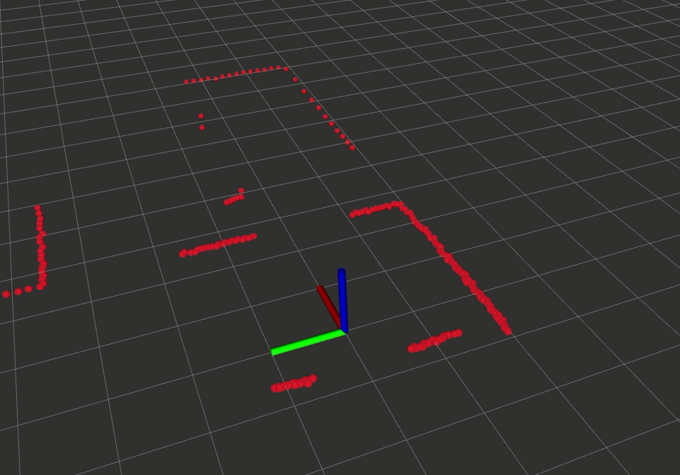
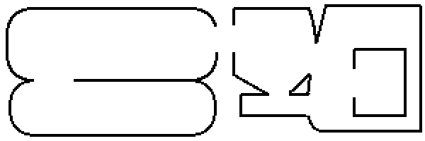

# basic_robot_simulator

Simple robot simulator ROS package using Bresenham ray-casting algorithm. Example visualization of the simulator in RViz:



The given map for the simulator (The robot in the GIF above starting on left bottom side of the map):



## Features

- ROS (outputs `/scan` and inputs `/cmd_vel`)
- Publishes simulator clock on ROS (so other nodes can adapt to the simulator speed rate)
- Publishes `odom`->`base_link` transform. (No noise implemented yet)
- Laser noise (gaussian mu and variance)
- Easy to read. Maybe? :)

## Running

```bash
$ roslaunch basic_robot_simulator start.launch  # => there are modifiable parameters in this file with descriptions
$ rosrun rqt_robot_steering rqt_robot_steering  # => you can use this command for manually controlling the robot
```

## Reference:

- https://en.wikipedia.org/wiki/Bresenham%27s_line_algorithm#All_cases